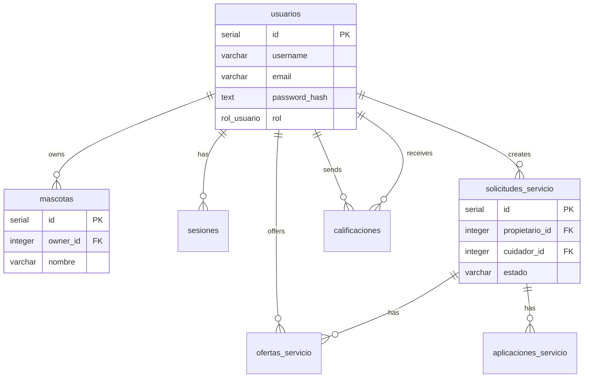

# PetCare BD

Este repositorio contiene el esquema de base de datos para PetCare, con una estructura profesional, en español y preparada para uso con PostgreSQL.

## Objetivo

Centralizar la definición del modelo relacional de la plataforma PetCare y mantener una base de datos coherente para backend y app móvil.

## Tecnologías

- PostgreSQL 15+
- SQL estándar con tipos enumerados
- Índices para consultas frecuentes
- Compatibilidad con Spring Boot + JPA

## Entidades principales

### usuarios
| Columna | Tipo | Descripción |
| --- | --- | --- |
| id | SERIAL | Identificador primario |
| username | VARCHAR(100) | Nombre de usuario único |
| email | VARCHAR(255) | Correo electrónico único |
| password_hash | TEXT | Hash de la contraseña |
| rol | rol_usuario | Rol del usuario |
| nombre | VARCHAR(100) | Nombre |
| apellido | VARCHAR(100) | Apellido |
| telefono | VARCHAR(30) | Teléfono |
| foto_perfil_url | TEXT | URL de la foto |
| created_at | TIMESTAMPTZ | Fecha de creación |
| last_login | TIMESTAMPTZ | Último inicio de sesión |
| is_active | BOOLEAN | Estado activo/inactivo |
| reset_token | TEXT | Token para recuperación |
| reset_token_expires | TIMESTAMPTZ | Expira la recuperación |

### mascotas
| Columna | Tipo | Descripción |
| --- | --- | --- |
| id | SERIAL | Identificador primario |
| owner_id | INTEGER | Dueño de la mascota |
| nombre | VARCHAR(120) | Nombre de la mascota |
| especie | VARCHAR(80) | Especie |
| raza | VARCHAR(120) | Raza |
| edad | INTEGER | Edad estimada |
| peso | NUMERIC(5,2) | Peso |
| descripcion | TEXT | Observaciones |
| created_at | TIMESTAMPTZ | Fecha de registro |
| updated_at | TIMESTAMPTZ | Última actualización |

### sesiones
| Columna | Tipo | Descripción |
| --- | --- | --- |
| id | SERIAL | Identificador primario |
| usuario_id | INTEGER | Usuario autenticado |
| token_sesion | TEXT | Token JWT o sesión |
| fecha_inicio | TIMESTAMPTZ | Inicio de sesión |
| ip_address | TEXT | Dirección IP |
| user_agent | TEXT | Navegador/dispositivo |
| fecha_fin | TIMESTAMPTZ | Cierre de sesión |
| logout_explicito | BOOLEAN | Si el cierre fue manual |

### solicitudes_servicio
| Columna | Tipo | Descripción |
| --- | --- | --- |
| id | SERIAL | Identificador primario |
| propietario_id | INTEGER | Usuario que crea la solicitud |
| cuidador_id | INTEGER | Cuidador asignado (opcional) |
| titulo | VARCHAR(150) | Título |
| descripcion | TEXT | Detalles del servicio |
| estado | VARCHAR(30) | Pendiente, aceptada, completada, cancelada |
| fecha_creacion | TIMESTAMPTZ | Fecha de creación |
| fecha_inicio | TIMESTAMPTZ | Inicio solicitado |
| fecha_fin | TIMESTAMPTZ | Fin solicitado |
| precio_estimado | NUMERIC(10,2) | Presupuesto |

### ofertas_servicio
| Columna | Tipo | Descripción |
| --- | --- | --- |
| id | SERIAL | Identificador primario |
| solicitud_id | INTEGER | Solicitud asociada |
| cuidador_id | INTEGER | Cuidador que ofrece el servicio |
| precio_ofertado | NUMERIC(10,2) | Precio propuesto |
| mensaje | TEXT | Comentario del cuidador |
| estado | VARCHAR(30) | Pendiente / aceptada / rechazada |
| fecha_creacion | TIMESTAMPTZ | Fecha de la oferta |

### aplicaciones_servicio
| Columna | Tipo | Descripción |
| --- | --- | --- |
| id | SERIAL | Identificador primario |
| solicitud_id | INTEGER | Solicitud aplicable |
| cuidador_id | INTEGER | Cuidador que aplica |
| estado | VARCHAR(30) | Estado actual |
| mensaje | TEXT | Mensaje de aplicación |
| fecha_creacion | TIMESTAMPTZ | Fecha de la aplicación |

### calificaciones
| Columna | Tipo | Descripción |
| --- | --- | --- |
| id | SERIAL | Identificador primario |
| emisor_id | INTEGER | Usuario que califica |
| receptor_id | INTEGER | Usuario calificado |
| solicitud_id | INTEGER | Solicitud asociada |
| puntuacion | INTEGER | Valor de 1 a 5 |
| comentario | TEXT | Comentario opcional |
| fecha_creacion | TIMESTAMPTZ | Fecha de la calificación |

### recuperacion_contraseña
| Columna | Tipo | Descripción |
| --- | --- | --- |
| id | SERIAL | Identificador primario |
| usuario_id | INTEGER | Usuario afectado |
| token | TEXT | Token generado |
| expiracion | TIMESTAMPTZ | Vencimiento del token |
| usado | BOOLEAN | Token ya consumido |
| creado_en | TIMESTAMPTZ | Fecha de creación |

## Enum

### rol_usuario
```sql
'propietario', 'cuidador', 'administrador'
```

## Relaciones principales

- usuarios.id -> mascotas.owner_id
- usuarios.id -> sesiones.usuario_id
- usuarios.id -> solicitudes_servicio.propietario_id
- usuarios.id -> ofertas_servicio.cuidador_id
- usuarios.id -> calificaciones.emisor_id
- usuarios.id -> calificaciones.receptor_id
- solicitudes_servicio.id -> ofertas_servicio.solicitud_id

## Diagrama ER



## Inicialización

```bash
psql -U postgres -d petcare -f database/schema.sql
```

## Seeds

Ejemplos de datos base se encuentran en `database/seeds/seed.sql`.
