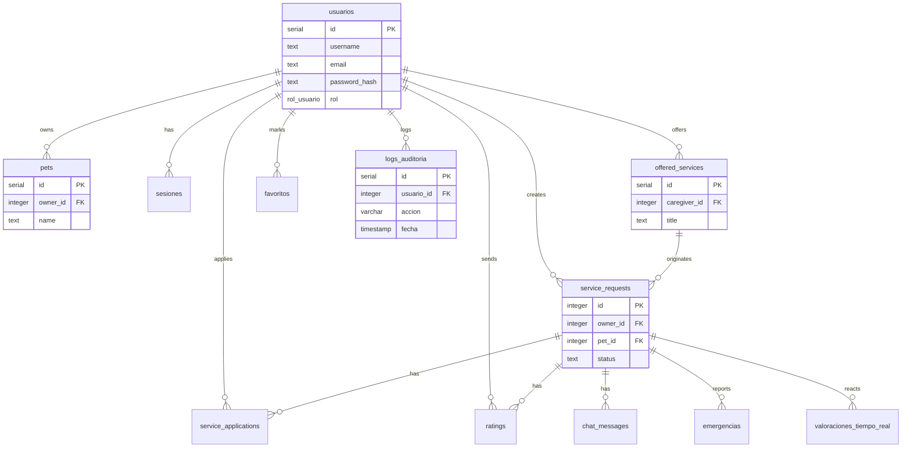

# PetCare BD

Este repositorio contiene el esquema de base de datos para PetCare, sincronizado con el
esquema real que usa el backend (`petcare-services`, Spring Boot + JPA con
`ddl-auto: validate`).

## Objetivo

Centralizar la definición del modelo relacional de la plataforma PetCare y mantener una
base de datos coherente para backend y app móvil.

> **Fuente de verdad:** el esquema vive primero en `petcare-services/migrations/`. Este
> repositorio es un espejo versionado de ese esquema para tenerlo documentado de forma
> independiente. Si haces un cambio de schema, aplícalo primero en `petcare-services` y
> luego sincroniza aquí (ver [MIGRATIONS.md](MIGRATIONS.md)).

## Tecnologías

- PostgreSQL 15+
- SQL estándar con tipos enumerados
- Índices para consultas frecuentes
- Compatibilidad con Spring Boot + JPA

## Entidades principales

### usuarios
| Columna | Tipo | Descripción |
| --- | --- | --- |
| id | SERIAL | Identificador primario |
| username | TEXT | Nombre de usuario único |
| email | TEXT | Correo electrónico único |
| password_hash | TEXT | Hash de la contraseña |
| rol | rol_usuario | Rol del usuario (administrador / propietario / gestor) |
| rol_confirmado | BOOLEAN | Si ya eligió rol de forma definitiva (no se puede cambiar después) |
| latitud / longitud / direccion_texto | DOUBLE PRECISION / TEXT | Ubicación registrada (Nominatim) |
| nombre / apellido / telefono | TEXT | Datos personales |
| foto_perfil_filename / foto_perfil_url | TEXT | Foto de perfil |
| created_at / last_login | TIMESTAMPTZ | Fechas de alta y último acceso |
| is_active | BOOLEAN | Estado activo/inactivo |
| reset_token / reset_token_expires | TEXT / TIMESTAMPTZ | Recuperación de contraseña |
| fcm_token | TEXT | Token de Firebase Cloud Messaging para notificaciones push |
| no_molestar | BOOLEAN | Silencia notificaciones push (solo cuidadores) |
| two_factor_enabled / two_factor_secret | BOOLEAN / TEXT | 2FA (reservado) |
| fecha_ultimo_cambio_password | TIMESTAMPTZ | Última vez que cambió su contraseña |
| bloqueado_hasta | TIMESTAMPTZ | Bloqueo temporal de la cuenta (reservado) |

### pets
| Columna | Tipo | Descripción |
| --- | --- | --- |
| id | SERIAL | Identificador primario |
| owner_id | INTEGER | Dueño de la mascota (FK a usuarios) |
| name | TEXT | Nombre de la mascota |
| species | TEXT | Especie |
| breed | TEXT | Raza |
| size | TEXT | Tamaño |
| age | INTEGER | Edad estimada |
| weight | NUMERIC(5,2) | Peso |
| description | TEXT | Observaciones |
| created_at / updated_at | TIMESTAMPTZ | Fechas de registro y actualización |

### offered_services
| Columna | Tipo | Descripción |
| --- | --- | --- |
| id | SERIAL | Identificador primario |
| caregiver_id | INTEGER | Cuidador que ofrece el servicio (FK a usuarios) |
| service_type_id | INTEGER | Tipo de servicio (id simple, sin tabla propia; ver app móvil) |
| title / description | TEXT | Detalle de la oferta |
| price | NUMERIC(10,2) | Precio |
| is_available | BOOLEAN | Si la oferta sigue activa |
| latitude / longitude | DOUBLE PRECISION | Ubicación de la oferta |
| created_at / updated_at | TIMESTAMPTZ | Fechas |

### service_requests
| Columna | Tipo | Descripción |
| --- | --- | --- |
| id | INTEGER (no autoincremental) | Identificador, generado por la app |
| owner_id | INTEGER | Propietario que solicita (FK a usuarios) |
| pet_id / pet_ids | INTEGER / TEXT | Mascota principal y lista de mascotas incluidas |
| service_type_id | INTEGER | Tipo de servicio |
| title / description | TEXT | Detalle de la solicitud |
| requested_date / start_time / end_time | TEXT | Fecha y horario solicitados |
| status | TEXT | PENDING / ACCEPTED / DONE_BY_CAREGIVER / CANCELLED / COMPLETED |
| offered_service_id | INTEGER | Oferta de origen, si la solicitud nació de un Flow A (FK a offered_services) |
| source_type | TEXT | OPEN (solicitud abierta) u OFFER (desde una oferta) |
| latitude / longitude | DOUBLE PRECISION | Ubicación del servicio |
| motivo_cancelacion | TEXT | Motivo si status = CANCELLED |
| fecha_expiracion | TIMESTAMPTZ | Vencimiento de la solicitud, si aplica |
| created_at / updated_at | TIMESTAMPTZ | Fechas |

### service_applications
| Columna | Tipo | Descripción |
| --- | --- | --- |
| id | SERIAL | Identificador primario |
| service_request_id | INTEGER | Solicitud a la que aplica (FK) |
| caregiver_id | INTEGER | Cuidador que aplica (FK a usuarios) |
| offered_service_id | INTEGER | Oferta relacionada, si aplica (FK) |
| initiated_by | TEXT | CAREGIVER (se postuló) u OWNER (lo invitó) |
| status | TEXT | PENDING / ACCEPTED / DONE_BY_CAREGIVER / REJECTED / CANCELLED |
| created_at / updated_at | TIMESTAMPTZ | Fechas |

Restricción: `UNIQUE(service_request_id, caregiver_id)` — un cuidador no puede aplicar dos veces a la misma solicitud.

### ratings
| Columna | Tipo | Descripción |
| --- | --- | --- |
| id | SERIAL | Identificador primario |
| service_request_id | INTEGER | Solicitud calificada (FK) |
| caregiver_id / owner_id | INTEGER | Participantes del servicio (FK a usuarios) |
| rated_by_role | TEXT | OWNER o CAREGIVER — quién emitió esta calificación |
| score | NUMERIC(2,1) | Puntuación (1.0 a 5.0) |
| comment | TEXT | Comentario opcional |
| respuesta_calificacion | TEXT | Respuesta pública del calificado |
| created_at | TIMESTAMPTZ | Fecha |

Restricción: `UNIQUE(service_request_id, rated_by_role)` — cada lado del servicio califica una sola vez.

### chat_messages
| Columna | Tipo | Descripción |
| --- | --- | --- |
| id | SERIAL | Identificador primario |
| service_request_id | INTEGER | Solicitud asociada al chat (FK) |
| sender_id / receiver_id | INTEGER | Participantes (FK a usuarios) |
| message | TEXT | Contenido |
| is_read | BOOLEAN | Si el receptor ya lo leyó |
| image_url | TEXT | URL de una imagen adjunta al mensaje (opcional), servida por `GET /api/chat/imagen/{filename}` |
| created_at | TIMESTAMPTZ | Fecha |

### emergencias
| Columna | Tipo | Descripción |
| --- | --- | --- |
| id | SERIAL | Identificador primario |
| service_request_id | INTEGER | Servicio en curso durante el que se reporta (FK) |
| reported_by | INTEGER | Quién reporta, dueño o cuidador (FK a usuarios) |
| tipo | TEXT | MEDICA / ACCIDENTE / MASCOTA_PERDIDA / OTRO |
| descripcion | TEXT | Detalle opcional de la emergencia |
| created_at | TIMESTAMPTZ | Fecha del reporte |

Botón de emergencia: se reporta durante un servicio en curso (`service_requests.status = 'ACCEPTED'`); el backend envía una notificación FCM al dueño, al cuidador asignado y a todos los usuarios con `rol = 'administrador'`.

### valoraciones_tiempo_real
| Columna | Tipo | Descripción |
| --- | --- | --- |
| id | SERIAL | Identificador primario |
| service_request_id | INTEGER | Servicio en curso al que aplica la reacción (FK) |
| usuario_id | INTEGER | Quién envía la reacción, normalmente el dueño (FK a usuarios) |
| tipo_reaccion | TEXT | CORAZON / ESTRELLA / PULGAR |
| created_at | TIMESTAMPTZ | Fecha de la reacción |

Reacción rápida enviada mientras el servicio está en curso (`service_requests.status = 'ACCEPTED'`), independiente de la calificación final que se deja al completar el servicio en `ratings`.

> Nota de procedencia: el DDL de `emergencias` y `valoraciones_tiempo_real` no se copió de
> un archivo literal, se redactó siguiendo las convenciones ya usadas en el resto del
> esquema (ver la nota en [MIGRATIONS.md](MIGRATIONS.md)). Vale la pena confirmarlo contra
> la especificación de producto original si está disponible.

### verificaciones
| Columna | Tipo | Descripción |
| --- | --- | --- |
| id | SERIAL | Identificador primario |
| email | TEXT | Correo a verificar |
| otp | TEXT | Código de un solo uso |
| fecha_expiracion | TIMESTAMPTZ | Vencimiento (5 minutos) |
| usado | BOOLEAN | Si ya se consumió |
| creado_en | TIMESTAMPTZ | Fecha de emisión |

### favoritos
| Columna | Tipo | Descripción |
| --- | --- | --- |
| id | SERIAL | Identificador primario |
| usuario_id | INTEGER | Quién marcó el favorito (FK a usuarios) |
| cuidador_id | INTEGER | Cuidador favorito (opcional, FK a usuarios) |
| mascota_id | INTEGER | Mascota favorita (opcional, FK a pets) |
| fecha_agregado | TIMESTAMPTZ | Fecha |

Restricción: exactamente uno de `cuidador_id` / `mascota_id` debe estar presente (`CHECK`), y cada combinación usuario+cuidador o usuario+mascota es única.

### notas_usuario
| Columna | Tipo | Descripción |
| --- | --- | --- |
| id | SERIAL | Identificador primario |
| propietario_id | INTEGER | Quién escribió la nota (FK a usuarios) |
| objetivo_id | INTEGER | Cuidador sobre el que se escribe (FK a usuarios) |
| nota | TEXT | Contenido, privado |
| fecha_creacion / fecha_actualizacion | TIMESTAMPTZ | Fechas |

### busquedas_guardadas
| Columna | Tipo | Descripción |
| --- | --- | --- |
| id | SERIAL | Identificador primario |
| usuario_id | INTEGER | Dueño de la búsqueda guardada (FK a usuarios) |
| nombre | TEXT | Nombre dado a la búsqueda |
| filtros_json | JSONB | Filtros serializados |
| fecha_creacion | TIMESTAMPTZ | Fecha |

### logs_auditoria
| Columna | Tipo | Descripción |
| --- | --- | --- |
| id | SERIAL | Identificador primario |
| usuario_id | INTEGER | Usuario que ejecutó la acción (opcional, FK a usuarios, `ON DELETE SET NULL`) |
| accion | VARCHAR(100) | Nombre de la acción registrada (login, cambio de datos sensibles, etc.) |
| detalles | JSONB | Payload libre con contexto adicional de la acción |
| ip | VARCHAR(45) | Dirección IP de origen |
| fecha | TIMESTAMP | Fecha del evento |

Bitácora de auditoría (migración 009). Todavía no hay código de aplicación en
`petcare-services` que escriba en esta tabla; el esquema se agregó primero según lo
solicitado, conectarla a eventos reales queda como trabajo futuro.

### sesiones / actividades / password_recovery
Tablas de soporte para autenticación: `sesiones` registra cada login (token, IP, user agent), `actividades` es una bitácora ligada a una sesión, y `password_recovery` guarda tokens de recuperación (histórico; el flujo activo usa `reset_token` en `usuarios`).

## Enum

### rol_usuario
```sql
'administrador', 'propietario', 'gestor'
```
La API y la app usan el término "cuidador" de cara al usuario; el backend (`RoleUtil`) lo traduce a `gestor` al persistir.

## Relaciones principales

- usuarios.id → pets.owner_id
- usuarios.id → sesiones.usuario_id
- usuarios.id → service_requests.owner_id
- usuarios.id → offered_services.caregiver_id
- usuarios.id → service_applications.caregiver_id
- usuarios.id → ratings.caregiver_id / ratings.owner_id
- usuarios.id → chat_messages.sender_id / chat_messages.receiver_id
- usuarios.id → favoritos.usuario_id / favoritos.cuidador_id
- pets.id → favoritos.mascota_id
- service_requests.id → service_applications.service_request_id
- service_requests.id → ratings.service_request_id
- service_requests.id → chat_messages.service_request_id
- service_requests.id → emergencias.service_request_id
- usuarios.id → emergencias.reported_by
- service_requests.id → valoraciones_tiempo_real.service_request_id
- usuarios.id → valoraciones_tiempo_real.usuario_id
- offered_services.id → service_requests.offered_service_id (origen Flow A)
- offered_services.id → service_applications.offered_service_id
- usuarios.id → logs_auditoria.usuario_id

## Diagrama ER



## Inicialización

```bash
psql -U postgres -d petcare -f database/schema.sql
psql -U postgres -d petcare -f database/seeds/seed.sql
```

Para aplicar los cambios incrementales por separado en vez de `schema.sql` completo, ver
`database/migrations/` y [MIGRATIONS.md](MIGRATIONS.md).

## Seeds

Datos de ejemplo en `database/seeds/seed.sql`: un administrador, un propietario con dos
mascotas, un cuidador con una oferta activa, y una solicitud con una postulación pendiente.
También incluye una fila de ejemplo (una o dos) para el resto de tablas: calificaciones,
mensajes de chat (incluyendo uno con `image_url`), una verificación OTP, favoritos, una nota
de usuario, una búsqueda guardada, una sesión, entradas de `logs_auditoria`, una emergencia
de ejemplo y una reacción de `valoraciones_tiempo_real`.
